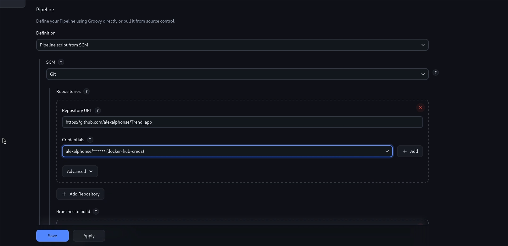

# Deploying a React application to a production ready state

## Step 01

### clone the repo

```
git clone https://github.com/Vennilavan12/Trend.git

```
## Step 02

### Dockerize the application


## Step 03

### Define infrastructure in main.tf 

## Step 04

### Create a declarative pipeline script in jenkinsfile

## Step 05

### Use terraform command to provision infrastructure.

```
terraform init

terraform plan

terraform apply --auto-approve

```

## Step 06

### Create a DockerHub repository


## Step 07

### Setup Kubernetes in AWS EKS


## Step 08

### Write deployment and service YAML files.


## Step 09

### upload to github

```
git add .
git commmit -m "Initial commit"
git push origin main

```


## Step 10

### install jenkins and add the neccesary plugins


## Step 11

### connect github and jenkins



## Step 12

### automate the pipeline and build


## Step 13

### check application output


